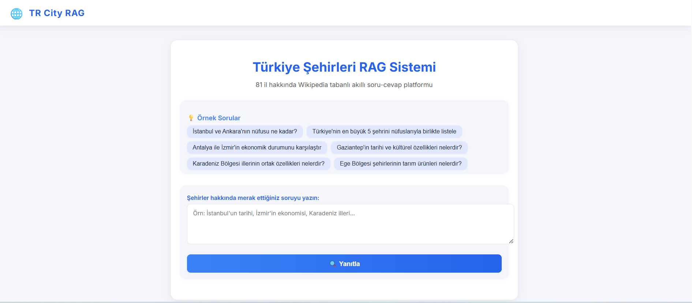

# Turkish Cities RAG System

A modern, interactive Retrieval-Augmented Generation (RAG) web application for answering questions about all 81 Turkish cities using Wikipedia as a knowledge base. The system leverages OpenAI's language models, LangChain, and FAISS for semantic search and intelligent Q&A.

## Features
- **Ask Anything About Turkish Cities:** Get up-to-date, detailed answers about any Turkish city.
- **Wikipedia-Powered:** Uses Turkish Wikipedia as the main data source.
- **Semantic Search:** Finds the most relevant information using vector embeddings and FAISS.
- **Sub-Question Decomposition:** Breaks down complex questions into sub-questions for more accurate answers.
- **Modern Web UI:** Responsive, user-friendly interface built with Flask and custom CSS.
- **Cost Tracking:** Displays OpenAI API token usage and cost per query.

## Demo


## Architecture
- **Backend:** Python, Flask, LangChain, FAISS, OpenAI, Wikipedia API
- **Frontend:** HTML5, CSS3 (responsive, modern design), JavaScript
- **Knowledge Base:** Turkish Wikipedia articles for all 81 cities

## Setup & Installation

### 1. Clone the Repository
```bash
git clone https://github.com/BilalEnesS/turkish-cities-rag.git
cd turkish-cities-rag
```

### 2. Install Python Dependencies
It is recommended to use a virtual environment:
```bash
python -m venv venv
source venv/bin/activate  # On Windows: venv\Scripts\activate
pip install -r requirements.txt
```

### 3. Environment Variables
Create a `.env` file in the project root with the following content:
```env
OPENAI_API_KEY=your-openai-api-key-here
```
- **OPENAI_API_KEY:** Required for OpenAI API access (get it from https://platform.openai.com/)


### 4. Run the Application
```bash
python app.py
```
- The app will be available at [http://localhost:5000](http://localhost:5000)
- On first run, Wikipedia data for all 81 cities will be downloaded and indexed (may take a few minutes)

## Usage
- Open the web app in your browser.
- Try the example questions or ask your own about any Turkish city.
- The system will show the answer, sub-questions, sources, and OpenAI API usage.

## Project Structure
```
├── app.py              # Main Flask backend and RAG logic
├── requirements.txt    # Python dependencies
├── .env                # Environment variables (not committed)
├── templates/
│   └── index.html      # Frontend UI
└── README.md           # This file
```

## Technologies Used
- **Flask**: Web server and routing
- **LangChain**: LLM orchestration and RAG pipeline
- **OpenAI**: GPT-4.1 for question answering
- **FAISS**: Vector database for semantic search
- **Wikipedia & wikipedia-api**: Data source for Turkish cities
- **python-dotenv**: Environment variable management

## Contributing
Contributions, bug reports, and feature requests are welcome! Please open an issue or submit a pull request.

## License
This project is licensed under the MIT License. 